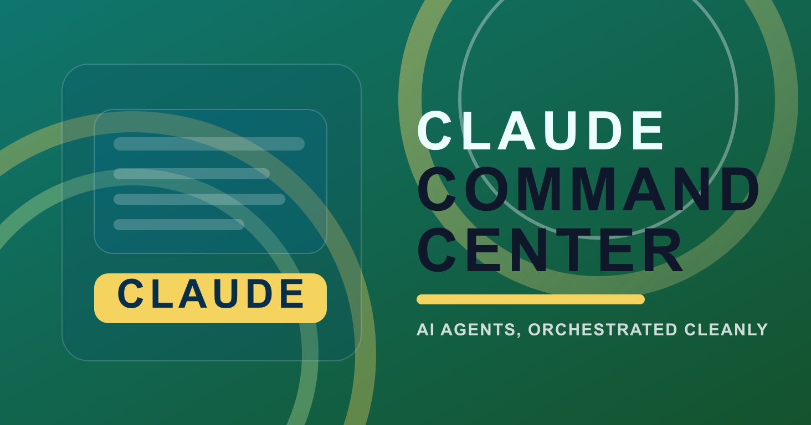
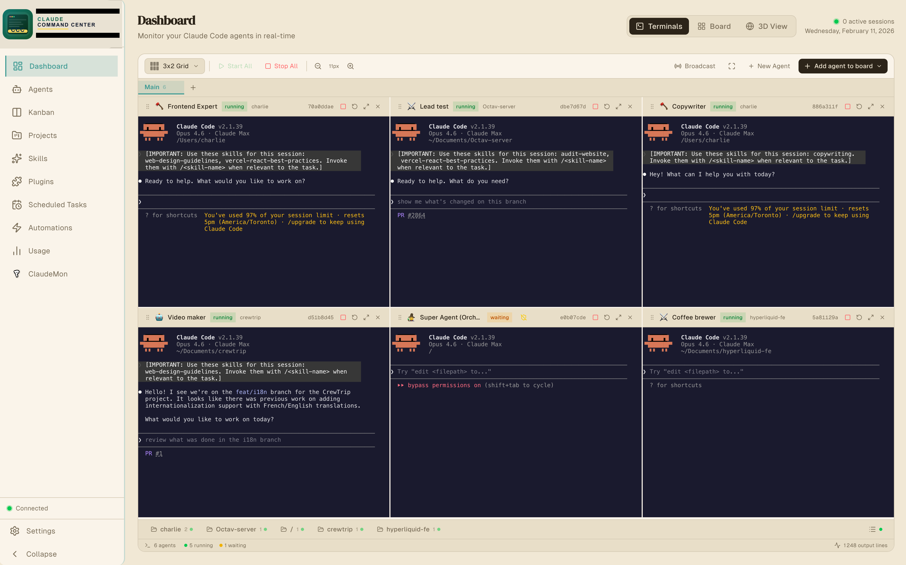
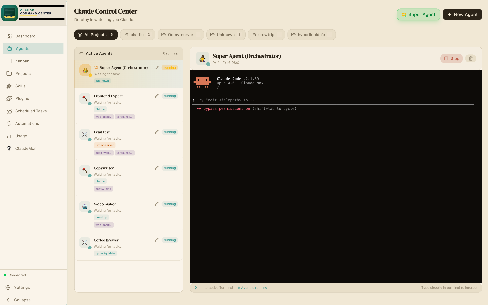
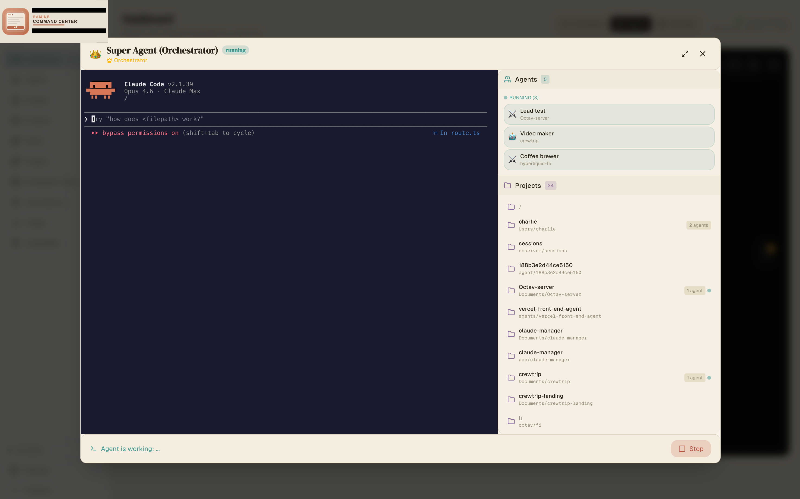
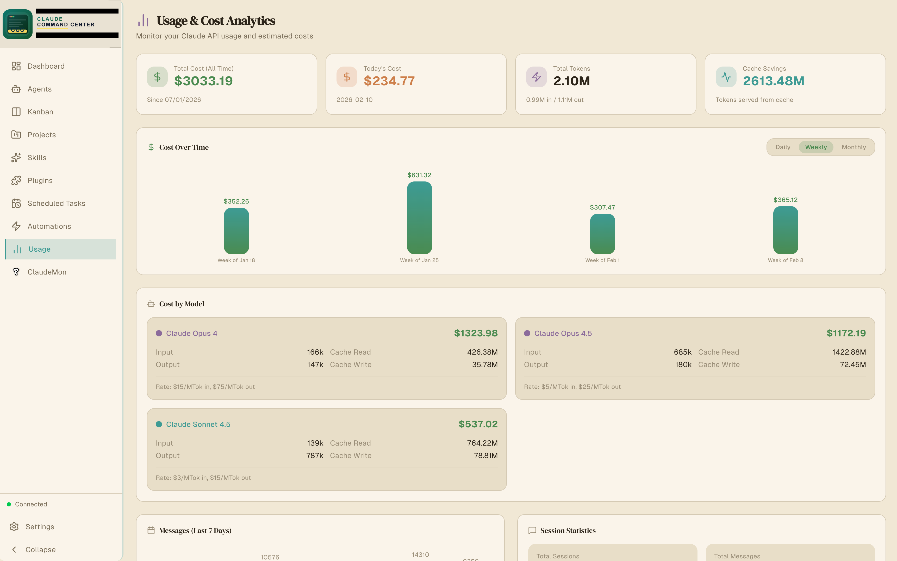
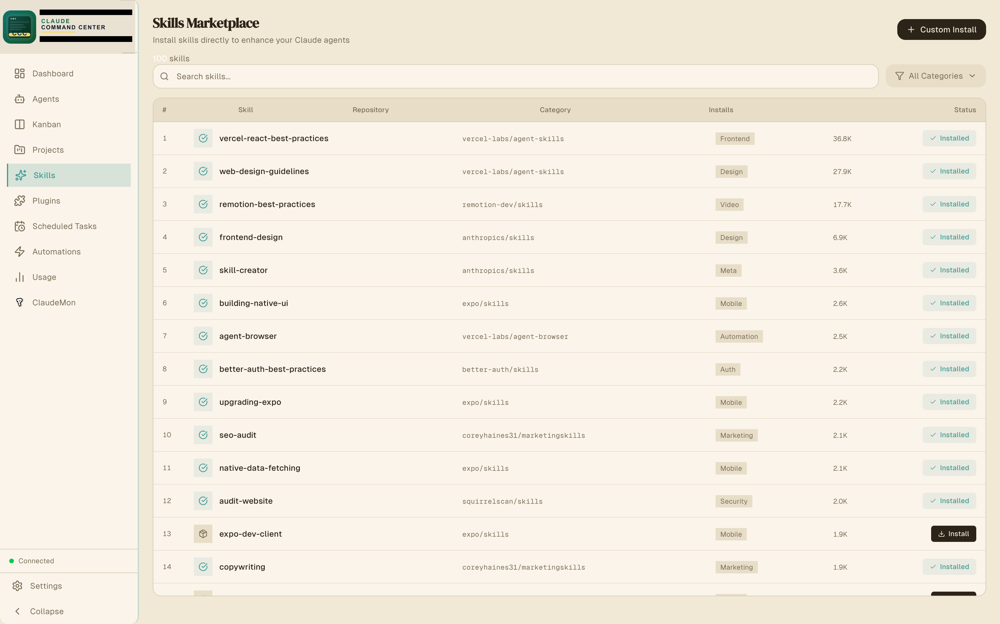
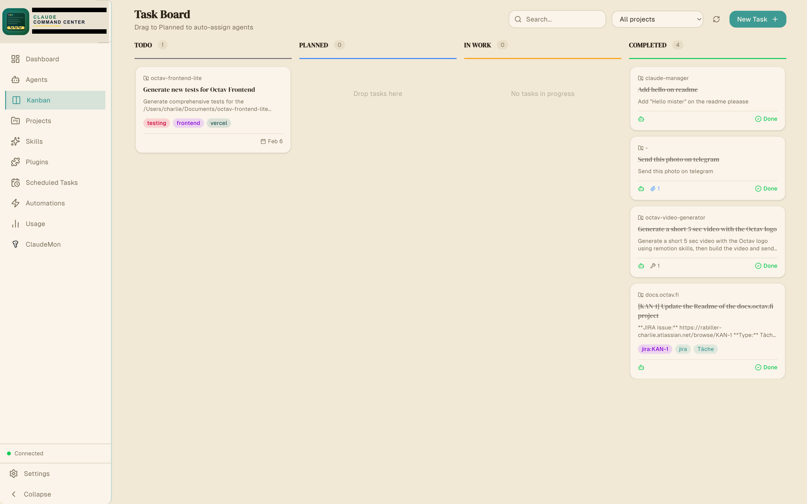
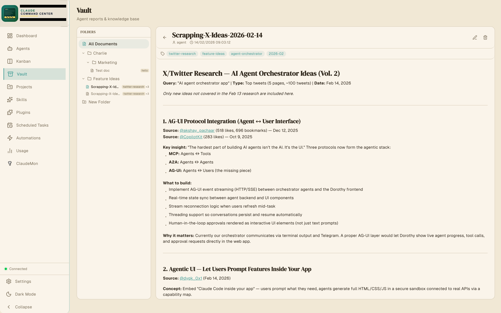

# Samins Command Center

A beautiful desktop app to orchestrate your [Claude Code](https://claude.ai/code) ,[Codex](https://chatgpt.com/codex), [Gemini](https://geminicli.com/) and local agents. Deploy, monitor, and debug — all from one delightful interface. Free and open source.

[](https://github.com/Samin12/claude-command-center-beta/releases/latest/download/Samins-Command-Center-mac-arm64.dmg)
[](https://github.com/Samin12/claude-command-center-beta/releases)
[](https://github.com/Samin12/claude-command-center-beta/releases/latest)

macOS users: click the `Download macOS DMG` button above.





## Installation

### Easiest Install

1. Download the desktop app:
   - macOS (Apple Silicon): [Download the DMG](https://github.com/Samin12/claude-command-center-beta/releases/latest/download/Samins-Command-Center-mac-arm64.dmg)
   - Windows: check the [Releases page](https://github.com/Samin12/claude-command-center-beta/releases) for the current installer
2. Install it:
   - macOS: open the DMG and drag `Samins Command Center.app` into `Applications`
   - Windows: open the `.exe` installer and follow the prompts
3. Open the app.

If Claude Code is already installed on that computer, the app is ready to use.

If Claude Code is not installed yet, install it once from Anthropic's setup guide:
- [Set up Claude Code](https://docs.anthropic.com/en/docs/claude-code/getting-started)

After Claude Code is installed:
- open any project folder in Terminal
- run `claude` once
- come back to Samins Command Center and your projects/history/usage will appear automatically

### First-Launch Notes

- Samins Command Center reads local Claude Code data from `~/.claude`
- No extra setup is required just to browse local projects, sessions, history, and usage
- GitHub CLI is only needed if you want GitHub-based automations

### First-Launch Troubleshooting

- macOS: if Gatekeeper blocks first launch because the app is unsigned, right-click the app and choose `Open` once
- macOS fallback: run `xattr -cr /Applications/Samins\ Command\ Center.app`
- Windows: if SmartScreen warns, choose `More info` and then `Run anyway`

## Table of Contents

- [Why Samins Command Center](#why-claude-command-center)
- [Core Features](#core-features)
- [Automations](#automations)
- [Kanban Task Management](#kanban-task-management)
- [Scheduled Tasks](#scheduled-tasks)
- [Remote Control](#remote-control)
- [Vault](#vault)
- [SocialData (Twitter/X)](#socialdata-twitterx)
- [Google Workspace](#google-workspace)
- [MCP Servers & Tools](#mcp-servers--tools)
- [Installation](#installation)
- [Architecture](#architecture)
- [Project Structure](#project-structure)
- [Tech Stack](#tech-stack)
- [Configuration & Storage](#configuration--storage)
- [Development](#development)
- [Contributing](#contributing)
- [License](#license)

---

## Why Samins Command Center

AI CLI tools are powerful — but it runs one agent at a time, in one terminal. Samins Command Center removes that limitation:

- **Run 10+ agents simultaneously** across different projects and codebases
- **Automate agent workflows** — trigger agents on GitHub PRs, issues, and external events
- **Delegate and coordinate** — a Super Agent orchestrates other agents via MCP tools
- **Manage tasks visually** — Kanban board with automatic agent assignment
- **Schedule recurring work** — cron-based tasks that run autonomously
- **Control from anywhere** — Telegram and Slack integration for remote management

---

## Core Features

### Parallel Agent Management

Run multiple agents simultaneously, each in its own isolated PTY terminal session. Agents operate independently across different projects, codebases, and tasks.



**Capabilities:**
- Spawn unlimited concurrent agents across multiple projects
- Each agent runs in an isolated terminal with full PTY support
- Assign skills, model selection (sonnet, opus, haiku), and project context per agent
- Send interactive input to any running agent in real-time
- Real-time terminal output streaming per agent
- Agent lifecycle management: `idle` → `running` → `completed` / `error` / `waiting`
- Secondary project paths via `--add-dir` for multi-repo context
- Git worktree support for branch-isolated development
- Persistent agent state across app restarts
- Autonomous execution mode (`--dangerously-skip-permissions`) for unattended operation

### Super Agent (Orchestrator)

A meta-agent that programmatically controls all other agents. Give it a high-level task and it delegates, monitors, and coordinates the work across your agent pool.



- Creates, starts, and stops agents programmatically via MCP tools
- Delegates tasks based on agent capabilities and assigned skills
- Monitors progress, captures output, and handles errors
- Responds to Telegram and Slack messages for remote orchestration
- Can spin up temporary agents for one-off tasks and clean them up after

### Usage Tracking

Monitor Claude Code API usage across all agents — token consumption, conversation history, cost tracking, and activity patterns.



### Skills & Plugin System

Extend agent capabilities with skills from [skills.sh](https://skills.sh) and the built-in plugin marketplace.



- **Code Intelligence**: LSP plugins for TypeScript, Python, Rust, Go, and more
- **External Integrations**: GitHub, GitLab, Jira, Figma, Slack, Vercel
- **Development Workflows**: Commit commands, PR review tools
- Install skills per-agent for specialized task handling

### Settings Management

Configure Claude Code settings directly — permissions, environment variables, hooks, and model defaults.

---

## Automations

Automations poll external sources, detect new or updated items, and spawn Claude agents to process each item autonomously. This enables fully automated CI/CD-like workflows powered by AI.

### Supported Sources

| Source | Status | Polling Method |
|--------|--------|---------------|
| **GitHub** | Active | `gh` CLI — pull requests, issues, releases |
| **JIRA** | Active | REST API v3 — issues, bugs, stories, tasks |
| **Pipedrive** | Planned | — |
| **Twitter** | Planned | — |
| **RSS** | Planned | — |
| **Custom** | Planned | Webhook support |

### Execution Pipeline

1. **Scheduler** triggers the automation on its cron schedule or interval
2. **Poller** fetches items from the source (e.g., GitHub PRs via `gh` CLI)
3. **Filter** applies trigger conditions (event type, new vs. updated)
4. **Deduplication** skips already-processed items using content hashing
5. **Agent spawning** — a temporary agent is created for each item
6. **Prompt injection** — item data injected via template variables
7. **Autonomous execution** — agent runs with full MCP tool access
8. **Output delivery** — agent posts results to Telegram, Slack, or GitHub comments
9. **Cleanup** — temporary agent is deleted after completion

### Template Variables

Use these in your `agentPrompt` and `outputTemplate`:

#### GitHub Variables

| Variable | Description |
|----------|-------------|
| `{{title}}` | Item title (PR title, issue title, etc.) |
| `{{url}}` | Item URL |
| `{{author}}` | Item author |
| `{{body}}` | Item body/description |
| `{{labels}}` | Item labels |
| `{{repo}}` | Repository name |
| `{{number}}` | Item number (PR #, issue #) |
| `{{type}}` | Item type (pull_request, issue, etc.) |

#### JIRA Variables

| Variable | Description |
|----------|-------------|
| `{{key}}` | Issue key (e.g., `PROJ-123`) |
| `{{summary}}` | Issue summary |
| `{{status}}` | Current issue status |
| `{{issueType}}` | Issue type (Task, Bug, Story, etc.) |
| `{{priority}}` | Issue priority |
| `{{assignee}}` | Assigned user |
| `{{reporter}}` | Reporter name |
| `{{url}}` | Issue URL |
| `{{body}}` | Issue description |

### Example: Automated PR Review Bot

```javascript
create_automation({
  name: "PR Code Reviewer",
  sourceType: "github",
  sourceConfig: '{"repos": ["myorg/myrepo"], "pollFor": ["pull_requests"]}',
  scheduleMinutes: 15,
  agentEnabled: true,
  agentPrompt: "Review this PR for code quality, security issues, and performance. PR: {{title}} ({{url}}). Description: {{body}}",
  agentProjectPath: "/path/to/myrepo",
  outputGitHubComment: true,
  outputSlack: true
})
```

### Example: JIRA Issue Processor

```javascript
create_automation({
  name: "JIRA Task Agent",
  sourceType: "jira",
  sourceConfig: '{"projectKeys": ["PROJ"], "jql": "status = Open"}',
  scheduleMinutes: 5,
  agentEnabled: true,
  agentPrompt: "Work on JIRA issue {{key}}: {{summary}}. Description: {{body}}. Priority: {{priority}}.",
  agentProjectPath: "/path/to/project",
  outputJiraComment: true,
  outputJiraTransition: true,
  outputTelegram: true
})
```

JIRA automations also create Kanban tasks automatically in the backlog, allowing agents to pick them up via the auto-assignment system.

---

## Kanban Task Management

A task board integrated with the agent system. Tasks flow through columns and can be automatically assigned to agents based on skill matching.



### Workflow

```
Backlog → Planned → Ongoing → Done
```

- **Priority levels**: Low, Medium, High
- **Progress tracking**: 0-100% per task
- **Agent assignment**: Assign tasks to specific agents or let the system auto-assign
- **Labels and tags**: Organize and filter tasks
- **Skill requirements**: Define required skills — the system matches tasks to capable agents

### Automatic Agent Assignment

The `kanban-automation` service continuously watches for new tasks and:

1. Matches task skill requirements against available agents
2. Creates new agents if no matching agent exists
3. Assigns the task and moves it to `ongoing`
4. Tracks progress as the agent works
5. Marks the task `done` when the agent completes

This enables a **self-managing task pipeline** — add tasks to the backlog and agents automatically pick them up.

---

## Scheduled Tasks

Run Claude Code autonomously on a cron schedule. Useful for recurring maintenance, reporting, monitoring, or any periodic task.

### Cron Format

```
┌───────────── minute (0-59)
│ ┌───────────── hour (0-23)
│ │ ┌───────────── day of month (1-31)
│ │ │ ┌───────────── month (1-12)
│ │ │ │ ┌───────────── day of week (0-7, 0 and 7 = Sunday)
│ │ │ │ │
* * * * *
```

| Expression | Schedule |
|-----------|----------|
| `0 9 * * *` | Daily at 9:00 AM |
| `0 9 * * 1-5` | Weekdays at 9:00 AM |
| `*/15 * * * *` | Every 15 minutes |
| `0 */2 * * *` | Every 2 hours |
| `30 14 * * 1` | Mondays at 2:30 PM |

### Platform Support

- **macOS**: Uses `launchd` (launchctl) for reliable background execution
- **Linux**: Uses `cron` (crontab)

### Storage

- Task definitions: `~/.claude/schedules.json`
- Generated scripts: `~/.claude-command-center/scripts/`
- Execution logs: `~/.claude/logs/`

---

## Remote Control

### Telegram Integration

Control your entire agent fleet from Telegram. Start agents, check status, delegate tasks to the Super Agent — all from your phone.

| Command | Description |
|---------|-------------|
| `/status` | Overview of all agents and their states |
| `/agents` | Detailed agent list with current tasks |
| `/projects` | List all projects with their agents |
| `/start_agent <name> <task>` | Spawn and start an agent with a task |
| `/stop_agent <name>` | Stop a running agent |
| `/ask <message>` | Delegate a task to the Super Agent |
| `/usage` | API usage and cost statistics |
| `/help` | Command reference |

Send any message without a command to talk directly to the Super Agent.

**Media support** via the `mcp-telegram` server: send photos, videos, and documents.

**Setup:**
1. Create a bot via [@BotFather](https://t.me/botfather) and copy the token
2. Paste the bot token in **Settings**
3. Send `/start` to your bot to register your chat ID
4. Multiple users can authorize by sending `/start`

### Slack Integration

Same capabilities as Telegram, accessible via @mentions or direct messages.

| Command | Description |
|---------|-------------|
| `status` | Overview of all agents |
| `agents` | Detailed agent list |
| `projects` | List projects with agents |
| `start <name> <task>` | Spawn and start an agent |
| `stop <name>` | Stop a running agent |
| `usage` | API usage and cost statistics |
| `help` | Command reference |

**Features:** @mentions in channels, DMs, Socket Mode (no public URL), thread-aware responses.

**Setup:**
1. Go to [api.slack.com/apps](https://api.slack.com/apps) → **Create New App** → **From scratch**
2. Name it "Samins Command Center" and select your workspace
3. **Socket Mode** → Enable → Generate App Token with scope `connections:write` (`xapp-...`)
4. **OAuth & Permissions** → Add scopes: `app_mentions:read`, `chat:write`, `im:history`, `im:read`, `im:write`
5. **Install to Workspace** → Copy Bot Token (`xoxb-...`)
6. **Event Subscriptions** → Enable → Subscribe to: `app_mention`, `message.im`
7. **App Home** → Enable "Messages Tab"
8. Paste both tokens in **Settings → Slack** and enable

---

## Vault

A persistent document storage system that agents can read, write, and search across sessions. Use it as a shared knowledge base — agents store reports, analyses, research findings, and structured notes that any other agent can access later.



### Features

- **Markdown documents** with title, content, tags, and file attachments
- **Folder organization** with nested hierarchies (auto-created on document creation)
- **Full-text search** powered by SQLite FTS5 — search across titles, content, and tags
- **Cross-agent access** — any agent can read documents created by another
- **File attachments** — attach files to documents for reference

### MCP Tools

| Tool | Parameters | Description |
|------|-----------|-------------|
| `vault_create_document` | `title`, `content`, `folder`, `tags?` | Create a document (auto-creates folder if needed) |
| `vault_update_document` | `document_id`, `title?`, `content?`, `tags?`, `folder_id?` | Update an existing document |
| `vault_get_document` | `document_id` | Read a document with full content and metadata |
| `vault_list_documents` | `folder_id?`, `tags?` | List documents, optionally filtered by folder or tags |
| `vault_delete_document` | `document_id` | Delete a document |
| `vault_attach_file` | `document_id`, `file_path` | Attach a file to a document |
| `vault_search` | `query`, `limit?` | Full-text search (supports AND, OR, NOT, phrase matching) |
| `vault_create_folder` | `name`, `parent_id?` | Create a folder (supports nesting) |
| `vault_list_folders` | — | List all folders as a tree |
| `vault_delete_folder` | `folder_id`, `recursive?` | Delete a folder (optionally with all contents) |

---

## SocialData (Twitter/X)

Search tweets, get user profiles, and retrieve engagement data via the [SocialData API](https://socialdata.tools). Useful for social media research, monitoring, and analysis tasks.

### Setup

1. Get an API key from [socialdata.tools](https://socialdata.tools)
2. Paste it in **Settings → SocialData API Key**

### MCP Tools

| Tool | Parameters | Description |
|------|-----------|-------------|
| `twitter_search` | `query`, `type?`, `cursor?` | Search tweets with advanced operators (`from:`, `min_faves:`, `filter:images`, etc.) |
| `twitter_get_tweet` | `tweet_id` | Get full tweet details with engagement metrics |
| `twitter_get_tweet_comments` | `tweet_id`, `cursor?` | Get replies/comments on a tweet |
| `twitter_get_user` | `username` | Get a user's profile (bio, followers, stats) |
| `twitter_get_user_tweets` | `user_id`, `include_replies?`, `cursor?` | Get recent tweets from a user |

All tools support cursor-based pagination for large result sets.

---

## Google Workspace

Access Gmail, Drive, Sheets, Docs, Calendar, and more directly from your agents via the [Google Workspace CLI](https://github.com/googleworkspace/cli) (`gws`). Samins Command Center integrates `gws` as an MCP server so agents can read emails, manage files, create documents, and interact with Google APIs.

### Setup

1. Install **gcloud CLI** — required for OAuth setup (`brew install google-cloud-sdk`)
2. Install **gws CLI** — `npm install -g @googleworkspace/cli`
3. Open **Settings → Google Workspace** and follow the guided setup:
   - Click **Auth Setup** to create a Google Cloud project and OAuth client
   - Click **Auth Login** to authenticate with your Google account
   - Enable the toggle to register the MCP server with your agents
4. Optionally install **Agent Skills** for 100+ specialized Google Workspace skills

### Features

- **MCP server**: Runs `gws mcp` over stdio, exposing Google APIs as tools (10-80 tools per service)
- **Multi-provider**: MCP server registered with all configured providers (Claude, Codex, Gemini)
- **Service badges**: Settings page shows connected services with per-service access levels (READ / R/W)
- **Agent skills**: Detects and lists installed `gws-*` skills (e.g., `gws-gmail`, `gws-drive`, `gws-calendar`)
- **Update Access**: Re-run `gws auth login` to add or change OAuth scopes without re-running setup

### Default Services

| Service | Scope | Description |
|---------|-------|-------------|
| **Gmail** | Read/Write | Send, read, and manage email |
| **Drive** | Read/Write | Manage files, folders, and shared drives |
| **Sheets** | Read/Write | Read and write spreadsheets |
| **Calendar** | Read/Write | Manage calendars and events |
| **Docs** | Read/Write | Read and write documents |

Additional services (Slides, Tasks, Chat, People, Forms, Keep) are available based on OAuth scopes.

---

## MCP Servers & Tools

Samins Command Center exposes **five MCP (Model Context Protocol) servers** with **40+ tools** for programmatic agent control. These are used internally by the Super Agent and can be registered in any Claude Code session via `~/.claude/settings.json`.

### mcp-orchestrator

The main orchestration server — agent management, messaging, scheduling, and automations.

#### Agent Management Tools

| Tool | Parameters | Description |
|------|-----------|-------------|
| `list_agents` | — | List all agents with status, ID, name, project, and current task |
| `get_agent` | `id` | Get detailed info about a specific agent including output history |
| `get_agent_output` | `id`, `lines?` (default: 100) | Read an agent's recent terminal output |
| `create_agent` | `projectPath`, `name?`, `skills?`, `character?`, `skipPermissions?` (default: true), `secondaryProjectPath?` | Create a new agent in idle state |
| `start_agent` | `id`, `prompt`, `model?` | Start an agent with a task (or send message if already running) |
| `send_message` | `id`, `message` | Send input to a running agent (auto-starts idle agents) |
| `stop_agent` | `id` | Terminate a running agent (returns to idle) |
| `remove_agent` | `id` | Permanently delete an agent |
| `wait_for_agent` | `id`, `timeoutSeconds?` (300), `pollIntervalSeconds?` (5) | Poll agent until completion, error, or waiting state |

#### Messaging Tools

| Tool | Parameters | Description |
|------|-----------|-------------|
| `send_telegram` | `message` | Send a text message to Telegram (truncates at 4096 chars) |
| `send_slack` | `message` | Send a text message to Slack (truncates at 4000 chars) |

#### Scheduler Tools

| Tool | Parameters | Description |
|------|-----------|-------------|
| `list_scheduled_tasks` | — | List all recurring tasks with schedule and next run time |
| `create_scheduled_task` | `prompt`, `schedule` (cron), `projectPath`, `autonomous?` (true) | Create a recurring task |
| `delete_scheduled_task` | `taskId` | Remove a scheduled task |
| `run_scheduled_task` | `taskId` | Execute a task immediately |
| `get_scheduled_task_logs` | `taskId`, `lines?` (50) | Get execution logs |

#### Automation Tools

| Tool | Parameters | Description |
|------|-----------|-------------|
| `list_automations` | — | List all automations with status, source, schedule |
| `get_automation` | `id` | Get details including recent runs |
| `create_automation` | `name`, `sourceType`, `sourceConfig`, + [options](#automation-create-options) | Create a new automation |
| `update_automation` | `id`, + optional fields | Update configuration |
| `delete_automation` | `id` | Remove an automation |
| `run_automation` | `id` | Trigger immediately |
| `pause_automation` | `id` | Pause scheduled execution |
| `resume_automation` | `id` | Resume a paused automation |
| `run_due_automations` | — | Check and run all due automations |
| `get_automation_logs` | `id`, `limit?` (10) | Get execution history |
| `update_jira_issue` | `issueKey`, `transitionName?`, `comment?` | Update JIRA issue status and/or add a comment |

##### Automation Create Options

| Parameter | Type | Description |
|-----------|------|-------------|
| `sourceType` | enum | `github`, `jira`, `pipedrive`, `twitter`, `rss`, `custom` |
| `sourceConfig` | JSON string | Source config (e.g., `{"repos": ["owner/repo"], "pollFor": ["pull_requests"]}`) |
| `scheduleMinutes` | number | Poll interval in minutes (default: 30) |
| `scheduleCron` | string | Cron expression (alternative to interval) |
| `eventTypes` | string[] | Filter by event type (e.g., `["pr", "issue"]`) |
| `onNewItem` | boolean | Trigger on new items (default: true) |
| `onUpdatedItem` | boolean | Trigger on updated items |
| `agentEnabled` | boolean | Enable agent processing (default: true) |
| `agentPrompt` | string | Prompt template with `{{variables}}` |
| `agentProjectPath` | string | Project path for the agent |
| `agentModel` | enum | `sonnet`, `opus`, or `haiku` |
| `outputTelegram` | boolean | Post output to Telegram |
| `outputSlack` | boolean | Post output to Slack |
| `outputGitHubComment` | boolean | Post output as GitHub comment |
| `outputJiraComment` | boolean | Post a comment on the JIRA issue |
| `outputJiraTransition` | boolean | Transition the JIRA issue status |
| `outputTemplate` | string | Custom output message template |

---

### mcp-telegram

Standalone MCP server for Telegram messaging with media support.

| Tool | Parameters | Description |
|------|-----------|-------------|
| `send_telegram` | `message`, `chat_id?` | Send a text message |
| `send_telegram_photo` | `photo_path`, `chat_id?`, `caption?` | Send a photo/image |
| `send_telegram_video` | `video_path`, `chat_id?`, `caption?` | Send a video |
| `send_telegram_document` | `document_path`, `chat_id?`, `caption?` | Send a document/file |

Direct HTTPS API calls. File uploads via multipart form data. Markdown formatting support.

---

### mcp-kanban

MCP server for programmatic Kanban task management.

| Tool | Parameters | Description |
|------|-----------|-------------|
| `list_tasks` | `column?`, `assigned_to_me?` | List tasks, filter by column or assignment |
| `get_task` | `task_id` (prefix matching) | Get full task details |
| `create_task` | `title`, `description`, `project_path?`, `priority?`, `labels?` | Create a task in backlog |
| `move_task` | `task_id`, `column` | Move task between columns |
| `update_task_progress` | `task_id`, `progress` (0-100) | Update progress |
| `mark_task_done` | `task_id`, `summary` | Complete a task with summary |
| `assign_task` | `task_id`, `agent_id?` | Assign task to an agent |
| `delete_task` | `task_id` | Remove a task |

**Columns:** `backlog` → `planned` → `ongoing` → `done`

---

### mcp-vault

MCP server for persistent document management. See [Vault](#vault) for full tool reference.

---

### mcp-socialdata

MCP server for Twitter/X data via the SocialData API. See [SocialData (Twitter/X)](#socialdata-twitterx) for full tool reference.

---

### Build From Source Prerequisites

- **Node.js** 18+
- **npm** or yarn
- **Claude Code CLI**: `npm install -g @anthropic-ai/claude-code`
- **GitHub CLI** (`gh`) — required for GitHub automations

### Fastest macOS Install

```bash
git clone https://github.com/Samin12/claude-command-center-beta.git
cd claude-command-center-beta
npm run electron:install:mac
```

That command installs dependencies, builds the local Electron bundle, copies `Samins Command Center.app` into `/Applications` when possible, and opens it automatically.

### Build from Source

```bash
git clone https://github.com/Samin12/claude-command-center-beta.git
cd claude-command-center-beta
npm install
npx @electron/rebuild        # Rebuild native modules for Electron
npm run electron:dev          # Development mode
npm run electron:build        # Production build (DMG)
npm run electron:build:local  # Unsigned local .app bundle
npm run electron:release:win  # Windows installer build
```

Output in `release/`:
- **macOS**: `release/mac-arm64/Samins Command Center.app` (Apple Silicon) or `release/mac/Samins Command Center.app` (Intel)
- DMG installer included

### Web Browser (Development)

```bash
npm install
npm run dev
```

Open [http://localhost:3000](http://localhost:3000). Agent management and terminal features require the Electron app.

---

## Architecture

### System Overview

```
┌──────────────────────────────────────────────────────────┐
│                     Electron App                          │
│                                                           │
│  ┌───────────────────┐  ┌──────────────────────────────┐ │
│  │  React / Next.js   │  │   Electron Main Process      │ │
│  │  (Renderer)        │←→│                               │ │
│  │                    │  │  ┌──────────────────────────┐ │ │
│  │  - Agent Dashboard │  │  │  Agent Manager           │ │ │
│  │  - Kanban Board    │  │  │  (node-pty, N parallel)  │ │ │
│  │  - Automations     │  │  ├──────────────────────────┤ │ │
│  │  - Scheduled Tasks │  │  │  PTY Manager             │ │ │
│  │  - Usage Stats     │  │  │  (terminal multiplexing) │ │ │
│  │  - Skills/Plugins  │  │  ├──────────────────────────┤ │ │
│  │  - Settings        │  │  │  Services:               │ │ │
│  │                    │  │  │  - Telegram Bot           │ │ │
│  └───────────────────┘  │  │  - Slack Bot              │ │ │
│          ↕ IPC           │  │  - Kanban Automation      │ │ │
│  ┌───────────────────┐  │  │  - MCP Server Launcher    │ │ │
│  │  API Routes        │  │  │  - API Server             │ │ │
│  │  (Next.js)         │←→│  └──────────────────────────┘ │ │
│  └───────────────────┘  └──────────────────────────────┘ │
└──────────────────────────────────────────────────────────┘
           ↕ stdio                     ↕ stdio
┌──────────────────┐ ┌──────────────┐ ┌──────────────┐
│ mcp-orchestrator │ │ mcp-telegram │ │  mcp-kanban  │
│   (26+ tools)    │ │  (4 tools)   │ │  (8 tools)   │
└──────────────────┘ └──────────────┘ └──────────────┘
┌──────────────────┐ ┌──────────────┐
│    mcp-vault     │ │mcp-socialdata│
│   (10 tools)     │ │  (5 tools)   │
└──────────────────┘ └──────────────┘
```

### Data Flow: Parallel Agent Execution

1. User (or Super Agent) creates agent → API route → Agent Manager
2. Agent Manager spawns `claude` CLI process via node-pty (one per agent)
3. Multiple agents run concurrently, each in an isolated PTY session
4. Output streamed in real-time to the renderer via IPC
5. Status detected by parsing output patterns (running/waiting/completed/error)
6. Services notified (Telegram, Slack, Kanban) on status changes
7. Agent state persisted to `~/.claude-command-center/agents.json`

### Data Flow: Automation Pipeline

1. Scheduler triggers automation on cron schedule
2. Poller fetches items from source (GitHub via `gh` CLI, JIRA via REST API)
3. Filter applies trigger conditions, deduplicates via content hashing
4. Temporary agent spawned for each new/updated item
5. Prompt injected with item data via template variables
6. Agent executes autonomously with full MCP tool access
7. Agent delivers output via MCP tools (Telegram, Slack, GitHub comments, JIRA comments/transitions)
8. For JIRA automations, Kanban tasks are auto-created in the backlog
9. Temporary agent deleted, item marked as processed

### MCP Communication

All MCP servers communicate via **stdio** (standard input/output):

```
Claude Code ←→ stdio ←→ MCP Server
                         ├── Tool handlers (Zod-validated schemas)
                         └── @modelcontextprotocol/sdk
```

---

## Project Structure

```
claude-command-center/
├── src/                           # Next.js frontend (React)
│   ├── app/                       # Page routes
│   │   ├── agents/                # Agent management UI
│   │   ├── kanban/                # Kanban board UI
│   │   ├── automations/           # Automation management UI
│   │   ├── recurring-tasks/       # Scheduled tasks UI
│   │   ├── settings/              # Settings page
│   │   ├── skills/                # Skills management
│   │   ├── usage/                 # Usage statistics
│   │   ├── projects/              # Projects overview
│   │   ├── plugins/               # Plugin marketplace
│   │   └── api/                   # Backend API routes
│   ├── components/                # React components
│   ├── hooks/                     # Custom React hooks
│   ├── lib/                       # Utility functions
│   ├── store/                     # Zustand state management
│   └── types/                     # TypeScript type definitions
├── electron/                      # Electron main process
│   ├── main.ts                    # Entry point
│   ├── preload.ts                 # Preload script
│   ├── core/
│   │   ├── agent-manager.ts       # Agent lifecycle & parallel execution
│   │   ├── pty-manager.ts         # Terminal session multiplexing
│   │   └── window-manager.ts      # Window management
│   ├── services/
│   │   ├── telegram-bot.ts        # Telegram bot integration
│   │   ├── slack-bot.ts           # Slack bot integration
│   │   ├── api-server.ts          # HTTP API server
│   │   ├── mcp-orchestrator.ts    # MCP server launcher
│   │   ├── claude-service.ts      # Claude Code CLI integration
│   │   ├── hooks-manager.ts       # Git hooks management
│   │   └── kanban-automation.ts   # Task → Agent auto-assignment
│   ├── handlers/                  # IPC handlers
│   │   ├── ipc-handlers.ts       # Agent, skill, plugin IPC
│   │   └── gws-handlers.ts       # Google Workspace integration
├── mcp-orchestrator/              # MCP server (orchestration)
│   └── src/tools/
│       ├── agents.ts              # Agent management tools (9)
│       ├── messaging.ts           # Telegram/Slack tools (2)
│       ├── scheduler.ts           # Scheduled task tools (5)
│       └── automations.ts         # Automation tools (10+)
├── mcp-telegram/                  # MCP server (Telegram media)
│   └── src/index.ts               # Text, photo, video, document (4)
├── mcp-kanban/                    # MCP server (task management)
│   └── src/index.ts               # Kanban CRUD tools (8)
├── mcp-vault/                     # MCP server (document management)
│   └── src/index.ts               # Vault CRUD + search tools (10)
├── mcp-socialdata/                # MCP server (Twitter/X data)
│   └── src/index.ts               # Twitter search + user tools (5)
└── landing/                       # Marketing landing page
```

---

## Tech Stack

| Category | Technology | Version |
|----------|-----------|---------|
| **Framework** | Next.js (App Router) | 16 |
| **Frontend** | React | 19 |
| **Desktop** | Electron | 33 |
| **Styling** | Tailwind CSS | 4 |
| **State** | Zustand | 5 |
| **Animations** | Framer Motion | 12 |
| **Terminal** | xterm.js + node-pty | 5 / 1.1 |
| **Database** | better-sqlite3 | 11 |
| **MCP** | @modelcontextprotocol/sdk | 1.0 |
| **Telegram** | node-telegram-bot-api | 0.67 |
| **Slack** | @slack/bolt | 4.0 |
| **Validation** | Zod | 3.22 |
| **Language** | TypeScript | 5 |

---

## Configuration & Storage

### Configuration Files

| File | Description |
|------|-------------|
| `~/.claude-command-center/app-settings.json` | App settings (Telegram token, Slack tokens, preferences) |
| `~/.claude-command-center/cli-paths.json` | CLI tool paths for automations |
| `~/.claude/settings.json` | Claude Code user settings |

### Data Files

| File | Description |
|------|-------------|
| `~/.claude-command-center/agents.json` | Persisted agent state (all agents, all sessions) |
| `~/.claude-command-center/kanban-tasks.json` | Kanban board tasks |
| `~/.claude-command-center/automations.json` | Automation definitions and state |
| `~/.claude-command-center/processed-items.json` | Automation deduplication tracking |
| `~/.claude-command-center/vault.db` | Vault documents, folders, and FTS index (SQLite) |
| `~/.claude/schedules.json` | Scheduled task definitions |

### Generated Files

| Location | Description |
|----------|-------------|
| `~/.claude-command-center/scripts/` | Generated task runner scripts |
| `~/.claude/logs/` | Task execution logs |

---

## Development

### Scripts

```bash
npm run dev              # Next.js dev server
npm run electron:dev     # Electron + Next.js concurrent dev mode
npm run build            # Next.js production build
npm run electron:build   # Distributable Electron app (DMG)
npm run electron:pack    # Electron directory package
npm run lint             # ESLint
```

### Build Pipeline

1. Next.js production build
2. TypeScript compilation (Electron + MCP servers)
3. MCP servers built independently
4. `electron-builder` packages into distributable

### Environment

The app reads Claude Code configuration from:
- `~/.claude/settings.json` — User settings
- `~/.claude/statsig_metadata.json` — Usage statistics
- `~/.claude/projects/` — Project-specific data

---

## Contributing

Contributions are welcome. Please submit a Pull Request.

1. Fork the repository
2. Create your feature branch (`git checkout -b feature/my-feature`)
3. Commit your changes
4. Push to the branch
5. Open a Pull Request

## License

This project is open source and available under the [MIT License](LICENSE).

## Acknowledgments

- [Anthropic](https://anthropic.com) for Claude Code
- [skills.sh](https://skills.sh) for the skills ecosystem
